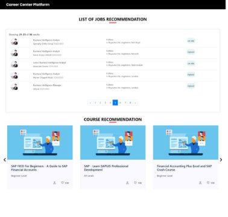
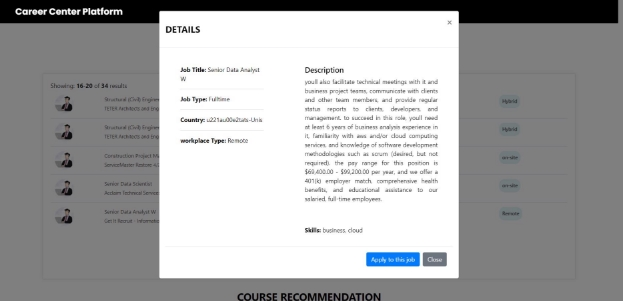

# CareerCenterPlateformProject
# 1  Introduction

In today’s data-driven world, data science has become increasingly important for organizations looking to gain a competitive edge and make data-driven decisions.

This report describes a data science project that involves creating a platform for the Career Center that will help students finding jobs and internships offers . IT will outline the steps taken to acquire, prepare, analyze, and visualize the data, and will presents our findings and recommendations based on the results of the analysis.

This report is intended to provide a comprehensive overview of the project and its outcomes, as well as to showcase the value and importance of data science in today’s business environment.

For this data science project, we followed the IBM master plan methodology, which is a comprehensive framework for managing data science projects. This methodology consists of several phases, each with its own set of tasks and deliverables, designed to guide the project team from planning to execution to deployment.

The IBM master plan methodology comprises the following phases :

1. **Business Understanding :** In this phase, we identify the business objectives and the problem statement that the project aimed to address.
1. **Data Understanding :** In this phase, we collect and analyze the data to gain a deeper understanding of its structure, quality, and relevance to the project.
1. **Data Preparation :** In this phase, we clean and transform the data to ensure its quality and suitability for analysis
1. **Modeling :** In this phase, we apply statistical and machine learning techniques to the data to develop models that could predict or explain the target variable.
1. **Evaluation :** In this phase, we evaluated the results of the analysis and assessed the accuracy and usefulness of the models
1. Deployment :

This methodology helped us to manage the project efficiently, identify potential risks and issues, and ensure that the project outcomes were aligned with the organization’s goals.

# 2  Business Understanding

The first step in the IBM Data Science Methodology is Business Understanding. In this phase the goal is to understand what we want to accomplish from a business perspective. In this case, this project aims to develop a platform for the Career Center which is an office dedicated to help esprit’s students and alumni find an internship or a job offer according to their qualification indicated on their resumes and develop new professional skills.

The career center seeks to fulfill this mission through the following objectives :

- Assists students in acquiring information, knowledge and competencies that enhance individual career development, academic success and employability .
- Provides services and resources that support students and graduates.
- Develop relationships with employers for the purpose of exploring the possibilities of internships and professional employment opportunities.

The employability pole can be used by students and graduates to research the various career alternatives and choose the one that best fits their interests and skill set.

There are numerous options available, regardless of whether someone is choosing a career path or looking for internships. Employability pole receives job offers from companies, which administrative will then email or put on the ”Esprit Connect” portal.

# 3  Analytic Approach

The main goal of this step is to answer the question ”How can we use data to solve the given problema-

tique”.

for our project, the data will be used to perform a PROFILING to analyze and gain a better understanding of raw data and categorize the Job offers and internships assigned to each profile.

Then to have a RECOMMENDATION SYSTEM that will help the job seeker or the student finding the right candidate in a short timeline.

The final step is to have a REPORTING dashboard that will generate a set of KPIs to determine the number of offers per period, geographic distribution, domain and identify the most requested technologies.

# 4  Data Requirements

In this phase we need to identify the Data needed for the project.

1. **Job Offers :** A job offers data collection will include several employment offers which will subsequently be suggested to users.
1. **Internship Offers :** A internship offers data set is also needed for this project and it will contain all the information related to an internship.
1. **Students’ resumes :** To have a well functional recommendation system, a data set for the student’s resumes will also be needed .
# 5  Data Collection

In this step we will answer the ”Where is the data coming from and how will we get it? ” question.

To gather the job offers, we directly scraped from Linkedin and Indeed web sites. We made sure to have a variety of offers depending on their location and sector.

For the internship offers, we had in our possession PFE books provided by different entreprises, so we applied regular expression to extract all the informations needed form the Pdf files.

To collect the students’s resumes and alumni looking for jobs offers, first we assembled the ones published on the Esprit Connect web site, then decided to also collect more from Linkedin using the web scraping method .

Figure 1 – The process of the data collection

# 6  Data Understanding

The data understanding process is a crucial step in data science project that involves exploring and describing the data before proceeding with modeling and analysis.

6.1 ***Data Visualization***

1. **Job Offers**

The final data collected contains the following columns :

- Job Title
- Description
- Location
- Posted At
- Company Name
- Workplace Type
- Job Type

Figure 2 – Job Offers Data Frame

Here we present some visualisation that we did in order to more understand our data, the chart below shows the top 10 job titles :

Figure 3 – Top 10 Jobs Then this pie char below relative to the top locations of the job offers :

Figure 4 – Top 10 Locations

2. **Internship Offers**

The final data set created contains the following columns :

- Description
- Duration
- Technologies
- Topic
- Trainees
- Location
- Field
- Company Name

The chart below represent the Geographical Distribution of Internship Offers

Figure 5 – Geographical Distribution

# 7  Data preparation
1. **Data cleaning**

Data cleaning is the process of correcting or removing corrupt, incorrect, or unnecessary data from the data frame .

1. **Missing values and duplication**

For the JOB OFFERS data set we notice that we have some missing values :

- 91 missing value in the COMPANY NAME .
- Two missing value in the JOB DESCRIPTION .
- 255 missing value in the WORK PLACE TYPE.

Since the number of missing values found is negligible compared to the total rows of the data set, we decided to drop them.

Next, we checked if we had duplicated rows, and also dropped them. Same with the INTERNSHIP OFFERS.

2. **Removing all special characters and Stop words**

To ensure the quality of the data and a good result of the models that will be applied later, it was considered necessary to apply some functions in order to remove all kind of special characters, punctuation and different stop words in order to have a clean text.

3. **Summarizing**

The JOB DESCRIPTION feature of the JOB OFFERS dataframe was found quite long and contains            useless information that does not add any value, therefore we decided to Summarize it using SUMY Library.

2. Data transformation

Data transformation is the process of changing the format, structure, or values of data in order to have a

1. **Translation**

The first transformation that was found necessary is the Translation, because we had data in different languages, and the goal was to have all the data in English for that we used the EasyNMT library.

2. **Skills extraction**

We extracted The skills from the job description by using a JSON File that contains a list of those skills. The function reads in the patterns from the file and adds them to the Spacy pipeline after the parser and before the named entity recognizer (NER).

# 8  Modeling
1. **Profiling**

One of the important steps in this project is to apply a profiling to the jobs offers ans also the students, in order to identify every filed or sector, which translate into The Clustering, the task of dividing the unlabeled data or data points into different clusters such that similar data points fall in the same cluster than those which differ from the others.

The figure below explain the schema of the clustering applied to the students and all the profiles that have been detected.

Figure 6 – Profiles clustering

We used KMeans clustering algorithm to cluster the job titles and the the Elbow method to find the optimal number of clusters , and as a result we had a data frame with a new feature which is the FIELD.

Figure 7 – Dataset after the clustering

After the clustering, we can have as shows in the chart below a representation of the jobs offers for each

filed.

Figure 8 – Jobs by fields

2. **Recommendation**

A recommendation system is a subclass of information filtering system that provide suggestions for items that are most pertinent to a particular user. the suggestions refer to various decision-making processes. Re- commendation systems are particularly useful when an individual needs to choose an item from a potentially overwhelming number of items or services.

1. **Users recommended job dataset**

In order to build a collaborative-based job recommendation system , a dataset of users who have recommended jobs will be needed.

This data will be used to generate recommendations for users based on their preferences and needs. Computing the Cosine Similarity using countvector

1. ***The CountVectorizer*** is used to create a count vector representation of users. This will convert each user Text description into a vector where each element corresponds to the count of a specific word in the Text .
1. ***Compute the cosine similarity between each pair of documents using the cosine similarity***. This will create a similarity matrix where the (i,j)th element is the cosine similarity between user text i and job offers j.
1. ***Get recommendations for a given user***, select the row of the similarity matrix that corresponds to the job , sort the similarities in descending order, and return the top k most similar jobs.
2. **Profile recommendation**

To identify profiles that are similar to a new user based on a profile database, we used a function that computes the cosine similarity between the new user’s profile and all other profiles in the database.

The cosine similarity score is a measure of the similarity between two vectors and can be used to identify profile that is the most similar to the new user’s profile.

Once the similarity scores are computed, the function can return the top profile that are most similar to the new user’s profile. This can be useful for making personalized recommendations to the new user based on the profiles of other users in the database.

Figure 9 – Profile recommendation

3. **Job Recommendation System**

We established a collaborative filtering recommender system, this technique recommends jobs to candi- dates based on the similarity between candidate profiles.

It uses historical data on candidate behavior, such as job applications and job offers, to compute the similarity between candidate profiles and recommend jobs that are similar to the jobs that other candidates with similar profiles have applied to or accepted.

Figure 10 – collaborative based filtering recommendation system

4. **Content-based recommendation**

Here the goal is to recommend jobs to candidates based on the similarity between job descriptions and candidate profiles.

Figure 11 – content based recommendation system

5. **Hybrid job recommendation system**

Hybrid job recommendation systems use a combination of content-based filtering, collaborative filtering, and knowledge-based approaches.

By combining these approaches, a hybrid job recommendation system can provide more accurate and personalized job recommendations than a single approach alone. It can also overcome the cold start problem, where there is not enough data available for a new user, by using knowledge-based recommendations until enough data is available for collaborative filtering.

Figure 12 – Hybrid recommendation system

6. **Insufficient skills and course recommendation**

To assist interns and job seekers in improving their resumes and skill sets, we suggest providing them with a list of skills that are not currently included in their profile and of similar users. In addition to this, we can also recommend a selection of relevant online courses that will help them acquire new skills and improve their employability.

To establish that :

1. Get the missing skills of the new job seeker in comparison to ***other users***.
1. Get the missing skills of the new job seeker in comparison to ***their profile***.

After identifying the missing relevant skills using TF-IDF, we recommend a list of online courses from popular platforms such as Udemy and Coursera to each user.

To determine the best courses to suggest, we used a similarity score based on the skills required by the courses and the skills that the user needs to acquire.

3. **Reporting**

Reporting is an essential component of a data science project as it helps to communicate the value of the project and its findings, enabling them to make informed decisions based on the data insights presented.

For this process we used Power BI which is a popular tool for reporting as it allows users to create interactive and dynamic reports that can be shared and accessed from anywhere. Power BI provides a wide range of visualizations and features that can be used to create customized and visually appealing reports.

Figure 13 – Reporting process

1. **Data warehousing**

First we merge the two data frame, the job offers and the internship offers and added a new column TYPE, then we load the data in the Sql Server data warehouse and generate fact and dimension tables.

2. **Cube Olap**

Cube OLAP are used to provide a multi-dimensional view of data that enables users to analyze large data sets quickly and efficiently, for that we used the SQL Server Analysis Services.

3. **Power Bi**

Finlay with Power Bi we created personalized and interactive data visualizations,the figures below shows some visualization from the dashboard created.

Figure 14 – Dimension of the data

Figure 15 – The offers Localisation

Figure 16 – Most Frequent locations in the field of Data Science

Figure 17 – Technologies required for Electronic and mechanical engineering

Figure 18 – Technologies required for artificial intelligence field

Figure 19 – Technologies required for web development field

Figure 20 – Technologies required for mobile development field

Figure 21 – Most Frequent technologies

9  **Evaluation**

The final step of the IBM Master Plan methodology is the evaluation where we need to answer to ”Does the model used really answer the initial question? ”

To establish this, we tested our recommendation system by choosing a profile from the job seekers.

Figure 22 – Job Seeker Test

1. **collaborative filtering recommender system**

Figure 23 – Result of the collaborative filtering recommender system

The figure above shows the result of the collaborative filtering recommender system applied to the job

seeker.

2. **Content-based filtering**

The outcome of the content filtering recommendation system used for business intelligence job searcher is illustrated in the figure above.

Figure 24 – Result of the Content-based filtering

3. **Hybrid job recommendation system**

To enhance the precision and comprehensiveness of our job recommendations, we utilized a combination of advanced recommendation techniques, including content-based filtering, collaborative filtering, and profile- based recommendation. The final outcome of our approach is clearly presented in the figure below, which illustrates the recommended jobs based on the user’s preferences, skills, and past job experiences.

Figure 25 – Result of the Hybrid job recommendation system

4. **Insufficient skills and course recommendation**

To assist job seeker in enhancing his resume and skill sets, we suggest providing him with a list of skills that are not currently included in his profile but are popular among similar users, as illustrated in Figure 26. Additionally, we recommend a selection of pertinent online courses to help him acquire new skills and improve his employability, as shown in Figure 27.

Figure 26 – Result of the skill recommendation

Figure 27 – Result of the course recommendation

# 10  Deployment

In this final phase, the deployment of all the work previously done, the project will take form as a platform for the users; the students and alumni that will allow them to upload their resumes and then according to their fields and preferences will recommand to them the top jobs or internships. Users will get a brief tutorial

explaining the recommendation system’s workings on the application’s first welcome page, making it a user- friendly platform that is simple to use.

Figure 28 – Welcome page

1. **Uploading the resume**

The first step in using the platform, the user has to upload his resume, as shows the figure below :

Figure 29 – Upload

2. **Recommandation**

The user will receive a list of the most pertinent internships or job offers following the submission of the resume and based on the content of the CV, whether they’re a student or a job seeker and also according to the field.

Figure 30 – List of jobs recommandation

The user can view additional information about each offer and decide whether or not to apply.

Figure 31 – Job offer detail

3. **Reporting**

Finally the platform includes a reporting dashboard as was described in the previous section.

Figure 32 – Reporting dashborad

# 11  Conclusion

In conclusion, a system recommendation system and reporting project can provide numerous benefits to businesses and organizations.

By analyzing data and using machine learning algorithms, a recommendation system can provide perso- nalized suggestions to users, increasing user engagement and satisfaction.

Additionally, the reporting aspect of the project can provide valuable insights and information for decision- making and improving business operations.
